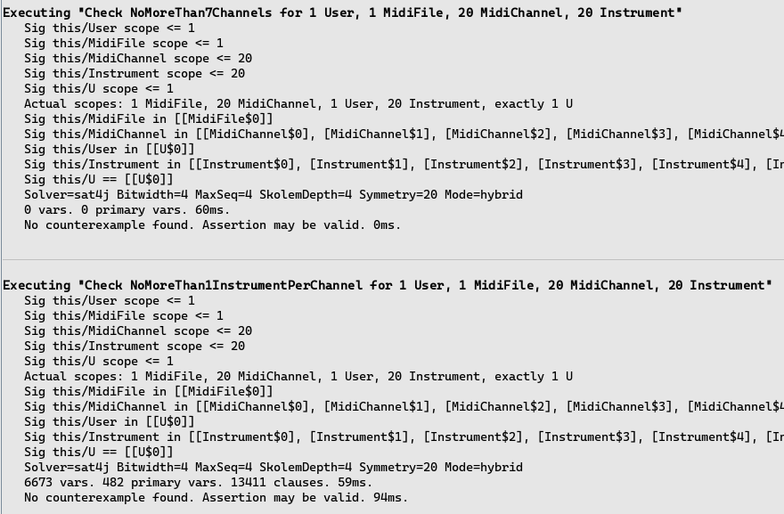

# Формальна верифікація специфікацій в Alloy

У цьому документі ми створимо просту специфікацію обмежень для даної системи з використанням Alloy.

## Опис системи

### Об’єкти:
- MIDI файл
- MIDI канали
- Користувач
- Інструменти

### Обмеження:
- Користувач працює з одним MIDI файлом
- MIDI файл може мати до 16 каналів
- Кожному каналу призначається один інструмент

Оскільки програму одночасно може використовувати тільки один користувач, об’явимо явно тільки одного користувача в Alloy. Також кількість каналів було обмежено на 7, бо коли обмеження 8 і більше, аналізатор Alloy не може знайти прикладів (хоча більше обмежень щодо кількості каналів не вказано).

## Рисунок №1 — Код моделі

## Рисунок №2 — Вивід аналізатора

## Рисунок №3 — Приклад виконання моделі

На прикладі видно інструменти, які не присвоєні MIDI каналам. Це задовольняє модель, тому що канали мають лише посилання на інструменти. Об’єкти класу `Instrument` не належать об’єктам класу `MidiChannel` і існують незалежно від них.

##
Також було перевірено обмеження `NoMoreThan7Channels` і `NoMoreThan1InstrumentPerChannel`, для яких не знайдено контрприкладів.

## Рисунок №4 — Перевірка обмежень

