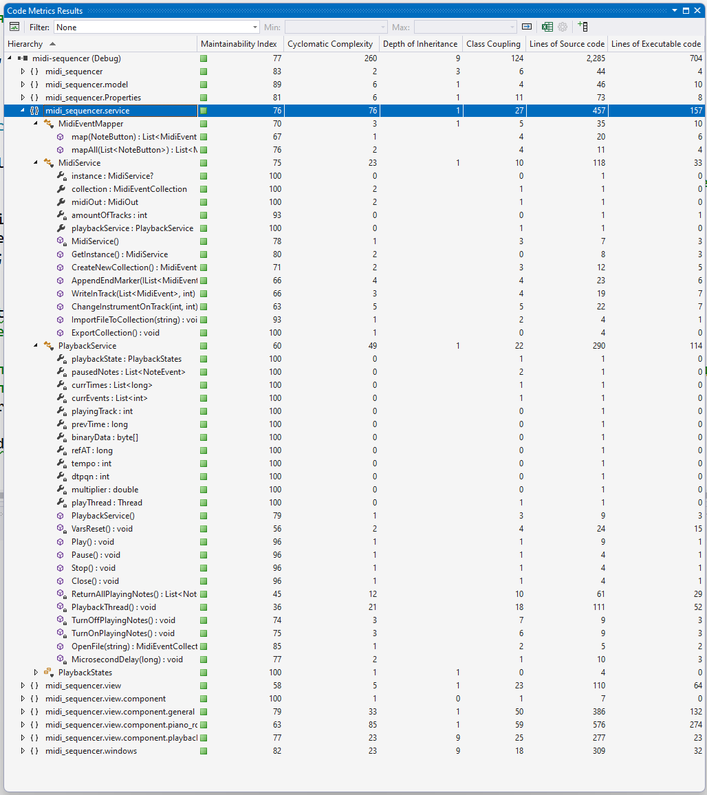
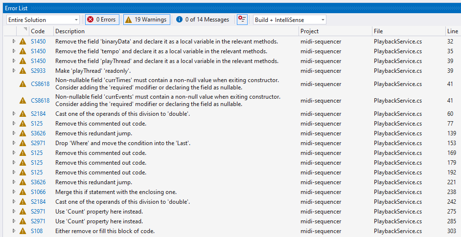

# Базові метрики якості коду

У цьому документі ми розглянемо базові метрики якості коду для проекту, відкривши його у Visual Studio 2022 та вирахувавши метрики коду вбудованим у IDE методом.

## Аналіз

Загостримо увагу на модулі `midi_sequencer.service`. З результатів можна зазначити:

- Модуль має індекс зручності підтримки 76, що є непоганим результатом.
- Цикломатична складність також дорівнює 76, що означає, що код має доволі складні алгоритми, які менш зручні для читання та підтримки.
- Глибина наслідування тут дорівнює 1, бо кожен клас тут є самостійним.
- Зв’язаність класів тут висока, 27.
- Кількість рядків коду дорівнює 457.

Найбільший негативний вплив на якість коду має метод `PlaybackThread` класу [`PlaybackService`](/src/service/PlaybackService.cs), який є дуже складним, має найвищу цикломатичну складність (21), найменший індекс зручності підтримки (36) та найбільше рядків коду (111).

## Рисунок №1 — Метрики у Visual Studio

## Аналіз коду

Проаналізуємо наявний код модуля `PlaybackService` за допомогою плагіна SonarQube для Visual Studio. Було знайдено такі недоліки:

- Закоментовані рядки коду
- Зайвий `continue`
- Кілька послідовних `if` стейтментів, які можна об’єднати в один
- Конструкція `if-else`, яку можна замінити на `switch`
- Використання полів класу замість локальних змінних у методах
- Використання методу `Count()` замість поля `Count` у циклах з перебором елементів контейнерів

Повний список попереджень зображений на **Рисунку №2**.

## Рисунок №2 — Попередження Visual Studio і SonarQube

