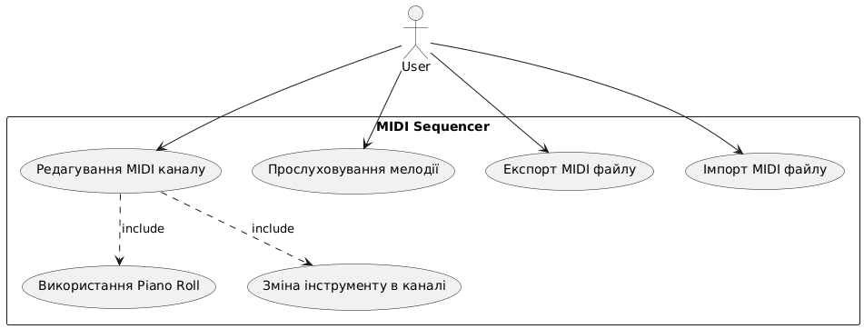
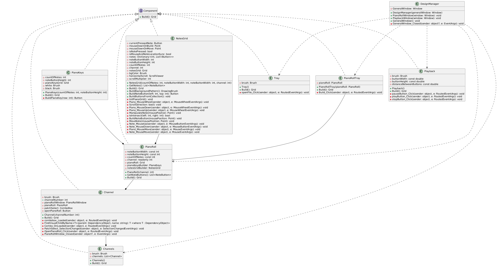
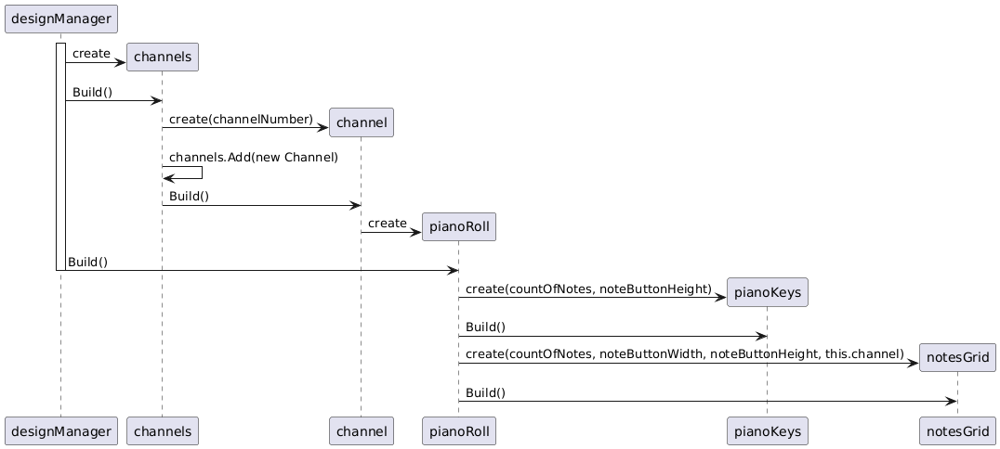

# Верифікація моделей архітектури у PlantUML

У цьому документі буде створено та описано діаграми використання, класів та послідовності для даного проекту.

## Діаграма використання
Почнемо зі створення діаграми використання. Необхідно створювати її у відповідності з [вимогами до програми](PROJECT_REQUIREMENTS.md).

- **Редагування MIDI каналу**: Основна дія, яку може виконати користувач. Вона включає в себе редагування параметрів MIDI каналу.
  - **Використання Piano Roll**: Цей випадок використання є частиною редагування MIDI каналу. Користувач може використовувати Piano Roll для візуального редагування нот.
  - **Зміна інструменту в каналі**: Ще один підвипадок, який включається в редагування MIDI каналу, дозволяє користувачу змінювати інструмент, що використовується в конкретному каналі.
- **Прослуховування мелодії**: Користувач може прослуховувати мелодію, щоб перевірити, як звучить редагований MIDI канал.
- **Експорт MIDI файлу**: Користувач має можливість експортувати створений або відредагований MIDI файл для подальшого використання.
- **Імпорт MIDI файлу**: Користувач може імпортувати існуючий MIDI файл в систему для редагування.


*Рисунок №1 — Діаграма використання*

<details>
 <summary>Опис use case діаграми у PlantUML</summary>

 ```
 @startuml
 
 actor User
 
 rectangle "MIDI Sequencer" {
     usecase "Редагування MIDI каналу" as UC1
     usecase "Використання Piano Roll" as UC5
     usecase "Зміна інструменту в каналі" as UC6
     usecase "Прослуховування мелодії" as UC2
     usecase "Експорт MIDI файлу" as UC3
     usecase "Імпорт MIDI файлу" as UC4
 }
 User --> UC1
 UC1 ..> UC5 : include
 UC1 ..> UC6 : include
 User --> UC2
 User --> UC3
 User --> UC4
 
 @enduml
 ```
</details>

## Діаграма класів модуля view
Створимо діаграму класів модуля view. У цьому модулі описані всі об’єкти графічного інтерфейсу (за винятком вікон) (Рисунок №9).

- Клас `DesignManager` використовується для створення вікон і наповнення їх графічними елементами, тож він прямо чи опосередковано посилається на них.  
- Всі графічні елементи наслідують інтерфейс `Component`.  
- Клас `Channels` є головною частиною вікна, де користувач може вибрати MIDI канал для роботи.  
- Клас `Tray` представляє меню у верхній частині головного вікна, де користувач може імпортувати MIDI файл.  
- Клас `Playback` представляє частину інтерфейсу з кнопками управління відтворенням мелодії.  
- Клас `PianoRoll` використовується для наповнення окремого вікна piano roll при редагуванні MIDI каналу.


*Рисунок №2 — Діаграма класів модуля view*

<details>
 <summary>Опис діаграми класів у PlantUML</summary>
 
 ```
 @startuml
 
 class DesignManager {
   -GeneralWindow: Window
 
   +DesignManager(generalWindow: Window)
   +PianoRollWindow(window: Window): void
   +PlaybackWindow(window: Window): void
   +GeneralWindow(): void
   -GeneralWindow_Closed(sender: object?, e: EventArgs): void
 }
 
 interface Component {
   +Build(): Grid
 }
 
 class Channel {
   -brush: Brush
   +channelNumber: int
   -pianoRollWindow: PianoRollWindow
   -pianoRoll: PianoRoll
   -patchSelect: ComboBox
   -openPianoRoll: Button
 
   +Channel(channelNumber: int)
   +Build(): Grid
   -combobox_Loaded(sender: object, e: RoutedEventArgs): void
   -FindVisualChildByName<T>(parent: DependencyObject, name: string): T <where T : DependencyObject>
   -Combo_OnLoaded(sender: object, e: RoutedEventArgs): void
   -PatchSelect_SelectionChanged(sender: object, e: SelectionChangedEventArgs): void
   -OpenPianoRoll_Click(sender: object, e: RoutedEventArgs): void
   -PianoRollWindow_Closed(sender: object?, e: EventArgs): void
 }
 
 class Channels {
   -brush: Brush
   -channels: List<Channel>
 
   +Channels()
   +Build(): Grid
 }
 
 class Playback {
   -brush: Brush
   -buttonWidth: const double
   -buttonHeight: const double
   -distanceBetweenButtons: const double
 
   +Playback()
   +Build(): Grid
   -pauseButton_Click(sender: object, e: RoutedEventArgs): void
   -playButton_Click(sender: object, e: RoutedEventArgs): void
   -stopButton_Click(sender: object, e: RoutedEventArgs): void
 }
 
 class Tray {
   -brush: Brush
 
   +Tray()
   +Build(): Grid
   -openFile_Click(sender: object, e: RoutedEventArgs): void
 }
 
 class NotesGrid {
   -currentPressedNote: Button
   -mouseDownOnBuild: Point
   -mouseDownOnMove: Point
   -isNotePressed: bool
   -isMouseAndNoteLocationSync: bool
   -notes: Dictionary<int, List<Button>>
   -noteButtonWidth: int
   -noteButtonHeight: int
   -countOfNotes: int
   -channel: int
   -notesGrid: Grid
   -bgColor: Brush
   -horizontalScroll: ScrollViewer
   -scrollMultiplier: int
 
   +NotesGrid(countOfNotes: int, noteButtonWidth: int, noteButtonWidth: int, channel: int)
   +GetNotes(): List<NoteButton>
   +Build(): Grid
   +BuildBackgroundPattern(): DrawingBrush
   +BuildNoteButton(left: int, top: int): Button
   +BuildButtonsFromCollection(): void
   -InitPianoGrid(): void
   -Piano_MouseWheel(sender: object, e: MouseWheelEventArgs): void
   -Scroll(direction: bool): void
   -Piano_MouseDown(sender: object, e: MouseWheelEventArgs): void
   -Piano_MouseUp(sender: object, e: MouseWheelEventArgs): void
   -ManipulateNote(mousePosition: Point): void
   -IsIntersect(left: int, right: int): bool
   -BuildNoteButton(mousePosition: Point): void
   -MoveNote(mousePosition: Point): void
   -Note_MouseUp(sender: object, e: MouseButtonEventArgs): void
   -Note_MouseDown(sender: object, e: MouseButtonEventArgs): void
   -Piano_MouseMove(sender: object, e: MouseEventArgs): void
   -Note_MouseMove(sender: object, e: MouseEventArgs): void
 }
 
 class PianoKeys {
   -countOfNotes: int
   -noteButtonHeight: int
   -pianoKeysGrid: Grid
   -white: Brush
   -black: Brush
 
   +PianoKeys(countOfNotes: int, noteButtonHeight: int)
   +Build(): Grid
   -BuildPianoKey(row: int): Button
 }
 
 class PianoRoll {
   -noteButtonWidth: const int
   -noteButtonHeight: const int
   -countOfNotes: const int
   -channel: readonly int
   -pianoRoll: Grid
   -pianoKeysBuilder: PianoKeys
   -notesGridBuilder: NotesGrid
 
   +PianoRoll(channel: int)
   +GetNoteButtons(): List<NoteButton>
   +Build(): Grid
 }
 
 class PianoRollTray {
   -pianoRoll: PianoRoll
 
   +PianoRollTray(pianoRoll: PianoRoll)
   +Build(): Grid
   -Build_Click(sender: object, e: RoutedEventArgs): void
 }
 
 Component <|.. Channel
 Component <|.. Channels
 Component <|.. Playback
 Component <|.. Tray
 Component <|.. NotesGrid
 Component <|.. PianoKeys
 Component <|.. PianoRoll
 Component <|.. PianoRollTray
 DesignManager ..> PianoRoll
 DesignManager ..> PianoRollTray
 DesignManager ..> Tray
 DesignManager ..> Playback
 DesignManager ..> Channels
 PianoRoll --* Channel
 Channel --* Channels
 NotesGrid --* PianoRoll
 PianoKeys --* PianoRoll
 PianoRollTray --o PianoRoll
 
 @enduml
 
 ```
</details>

## Діаграма послідовності створення графічних елементів
Створимо діаграму послідовності створення графічних елементів у програмі.  
- Спочатку у класі `DesignManager` створюється об’єкт класу `Channels`, у якому, у свою чергу, створюються 16 однакових об’єктів `Channel` з різними номерами, які записуються у список `channels` у об’єкті класу `Channels`.
- У об’єкті класу `Channel` створюються залежний від нього `PianoRoll`, у якому також створюються об’єкти `PianoKeys` та `NotesGrid`.


*Рисунок №3 — Діаграма послідовності створення графічних об’єктів*

<details>
 <summary>Опис діаграми послідовності у PlantUML</summary>
 
 ```
 @startuml
 activate DesignManager
 DesignManager -> Channels ** : create
 DesignManager -> Channels : Build()
 
 Channels -> Channel ** : create(channelNumber)
 Channels -> Channels : channels.Add(new Channel)
 Channels -> Channel : Build()
 
 Channel -> PianoRoll ** : create
 
 DesignManager -> PianoRoll : Build()
 deactivate DesignManager
 
 PianoRoll -> PianoKeys ** : create(countOfNotes, noteButtonHeight)
 PianoRoll -> PianoKeys : Build()
 PianoRoll -> NotesGrid ** : create(countOfNotes, noteButtonWidth, noteButtonHeight, this.channel)
 PianoRoll -> NotesGrid : Build()
 @enduml
 ```
</details>
