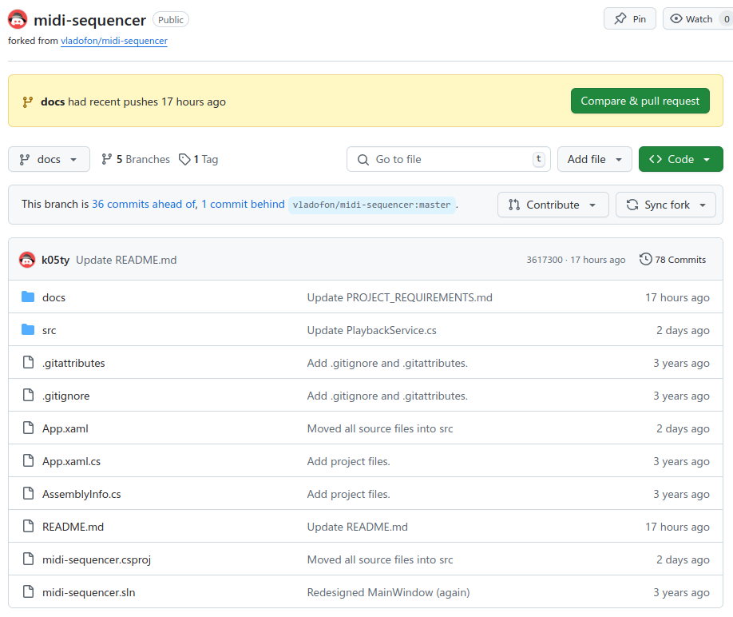

# Управління версіями та автоматизація

Для управління версіями використовувалась система Git та сервіс GitHub для синхронізації з хмарою.

На початку написання документації, найактуальніший код знаходився в гілці `pre-release-bugfix`. Спочатку було реорганізовано структуру репозиторію і переміщено більшість вихідного коду програми у директорію `src/`. Реалізовано це було у новій гілці `dev` (скорочення від Develop).

Документація для проекту була створена у новій гілці `docs`. В ній було додано всі markdown файли, в яких описується проект, вимоги до нього і т. д.

По закінченню роботи з документацією GitHub пропонує створити Pull request (рисунок №1).

*Рисунок №1 — Пропозиція створити Pull request*

При створенні Pull request потрібно обрати гілку, до якої необхідно здійснити об’єднання (у даному випадку `master`), надати назву та опис для pull request (рисунок №2). Нижче зображені всі комміти, які розділяють гілки `master` та `docs`.

*Рисунок №2 — Створення Pull request*

На рисунку №3 зображено створений Pull request. На рисунку №4 зображено конфлікти між гілками, які необхідно усунути.

  

*Рисунок №3 — Створений Pull request*

*Рисунок №4 — Конфлікти у Pull request*

Вирішимо конфлікти за допомогою редактора Visual Studio Code. На рисунку №1 приклад вирішення конфлікту у файлі `DesignManager.cs`. На рисунку №6 — граф гілки `master` після вирішення конфліктів.

  

*Рисунок №5 — Вирішення конфлікту на прикладі файлу DesignManager.cs*

*Рисунок №6 — Граф гілки master*

Після злиття гілок Pull request був успішно виконаний (рисунок №7).

*Рисунок №7 — Виконаний Pull request*
